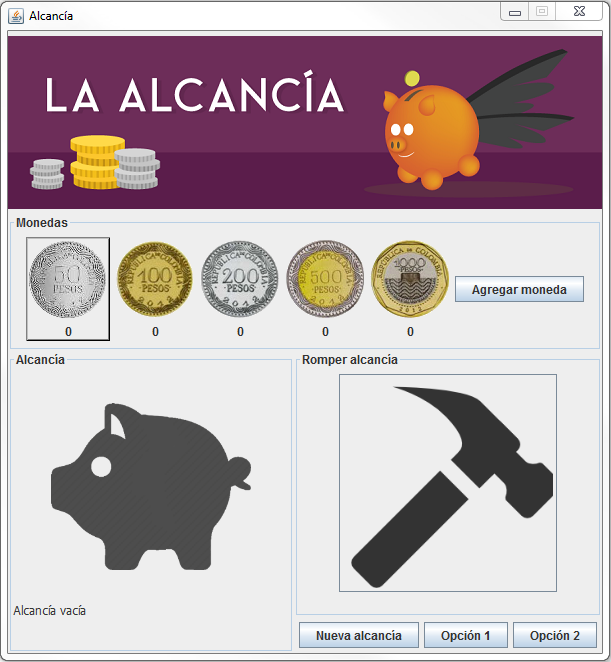

Enunciado
=========

Se desea construir una aplicación para manejar una alcancía. La alcancía
debe permitir guardar monedas de las siguientes denominaciones: $50, 
$100, $200, $500 y $1000. No se guardan ni billetes ni monedas de otras
denominaciones.
La alcancía debe mostrar cuántas monedas tiene de cada denominación en
todo momento. Adicionalmente, permite romper la alcancía, mostrando el
valor total que había en ella y vaciando su contenido.

El sistema debe permitir:

1. Agregar una moneda de una denominación dada a la alcancía.
2. Mostrar la cantidad de monedas que hay de cada denominación.
3. Mostrar el total de dinero que hay en la alcancía.
4. Romper la alcancía vaciando su contenido.
5. Crear una nueva alcancía.

Interfaz
========

